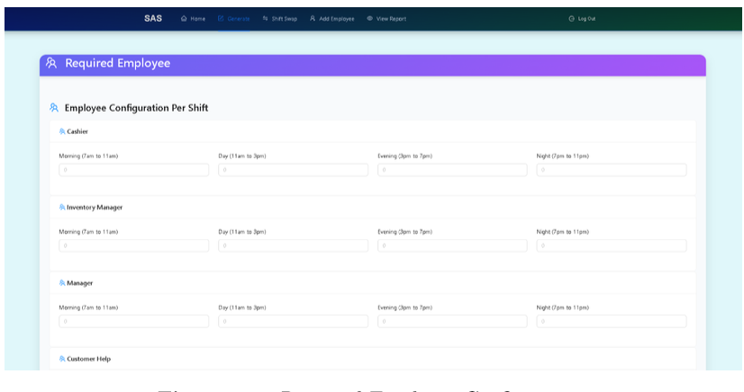
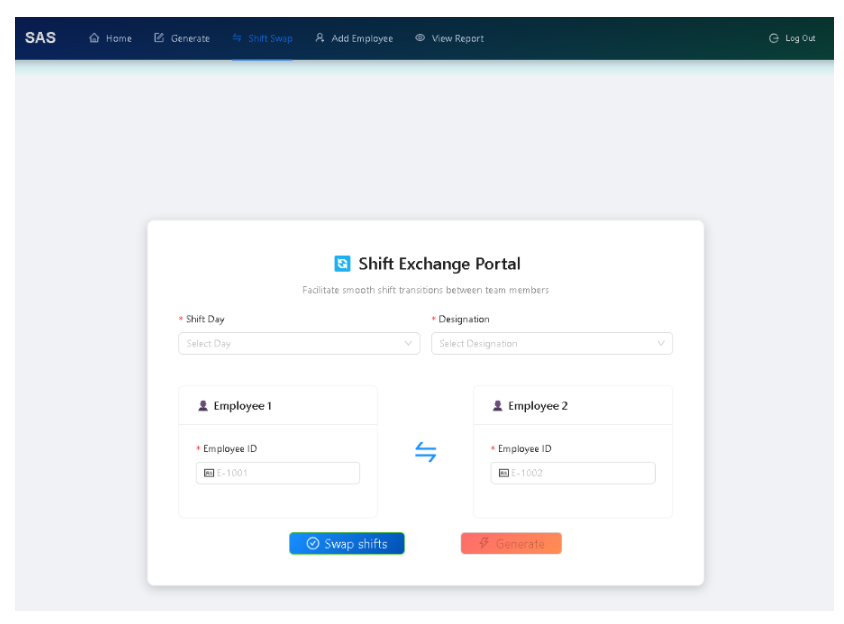

# Shift Allocation System

A full-stack workforce scheduling platform that automates employee shift allocation based on workload, working-hour constraints, employee priority, and designation. The system eliminates manual scheduling by generating optimized shift assignments while providing employee management, shift swapping, Excel export, and email notifications.

---
#### View the details at the fina_report.pdf

## 📸 Project Screenshots

### Dashboard
> Add Screenshot 1 here


---

### Employee Management
> Add Screenshot 2 here


---

### Shift Generation
> Add Screenshot 3 here


---

### Generated Schedule
> Add Screenshot 4 here



---

### Shift Swap
> Add Screenshot 5 here



---

# Features

- Automated employee shift allocation using workload, priority level, designation, and working-hour constraints.
- Employee management with complete CRUD operations.
- Shift swapping with constraint validation.
- Weekly schedule generation.
- Export schedules to Excel with designation-based color coding.
- Email generated schedules directly to employees.
- Authentication and authorization for HR managers.
- Responsive React dashboard.
- RESTful API powered by Django.

---

# Tech Stack

## Frontend

- React.js
- Ant Design
- Axios

## Backend

- Django
- Django REST Framework

## Database

- SQLite

## Libraries

- Pandas
- OpenPyXL

---

# System Architecture

```
React Frontend
       │
       │ REST API
       ▼
Django REST Framework
       │
       ▼
SQLite Database
```

---

# Core Modules

## Authentication

- Login
- Registration
- Protected APIs

## Employee Management

- Add Employee
- Update Employee
- Delete Employee
- View Employees

## Shift Management

- Automatic Shift Allocation
- Shift Swap
- Constraint Validation

## Reports

- Excel Export
- Email Schedule

---

# Scheduling Logic

The scheduling algorithm assigns employees based on:

- Maximum weekly working hours
- Employee designation
- Shift requirements
- Priority level
- Least hours worked
- Daily assignment limits

This ensures a fair and conflict-free distribution of shifts.

---

# Project Structure

```
frontend/
    src/

backend/
    api/
    scheduler/
    employees/

media/

requirements.txt
```

---

# Installation

## Clone Repository

```bash
git clone <repository-url>
cd shift-allocation-system
```

## Backend

```bash
pip install -r requirements.txt

python manage.py migrate

python manage.py runserver
```

## Frontend

```bash
npm install

npm start
```

---

# Future Improvements

- AI-based shift prediction
- Employee preference learning
- Mobile application
- Multi-tenant architecture
- Real-time notifications

---

# License

MIT License